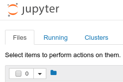

# User Guide for CSS NLP Lab Notebooks

## 0. Getting the Code and Data
To use these labs, you will need to download the code and the data. These are available for free online in two separate GitHub repositories. You **must** download both repositories.

#### Repositories
- **Code** https://github.com/UM-CSS/CSSLabs-NLP
- **Data** https://github.com/rudeboybert/JSE_OkCupid

#### Download a repository from GitHub
- If you are familiar with `git`
    - We recommend you clone each repo.
- If you are unfamiliar with `git`
    - Easiest option:
        - Press the  button on the right side of each repository.
        - Choose `Download ZIP` and save the file somewhere memorable.
        - Go to where the file is saved and unzip it.

#### Putting the data in its place
These labs use data from Journal of Statistical Education Paper on Using OkCupid Data for Data Science Courses. We do not want to host or distribute this data, which is why we asked you to get it from the authors' Github page above. Now you need to put this data somewhere our code can find it. Steps:
1. Open the JSE_OkCupid folder that you downloaded.
2. Unzip the file `profiles.csv.zip`.
3. Copy the unzipped file `profiles.csv`.
4. Open the folder `CSSLabs-NLP`.
5. Within that folder, open the folder `data`.
6. Paste the `profiles.csv` file into the `data` folder. 
    

## 1. Environment Setup
You will need some software to be able to run this code. Advanced users may view the required libraries in the [README](README.md) file. For all users, we recommend the following:
1. Download Anaconda 3.6 version from [this link](https://www.anaconda.com/download/).
    - Anaconda is an "installer" or "package manager" for python. It installs many of the tools, packages, and libraries that are commonly used in python data analysis. It can also be used to install and update additional packages. It is particularly nice because it makes sure that everything works together, which can be hard to do when installing each thing separately. 
2. Install Anaconda on your computer (there are instructions on their website if you have difficulty).
3. Once Anaconda is installed, you should be able to start the programs it includes just like you would start other programs. Test this now:
    - Search for a program called `anaconda navigator` and launch it. When it opens, you should see the option to launch `jupyter notebook`.
        - Alternatively, you can often search for `jupyter notebook` and launch that directly 
    - When jupyter launches, two things will happen:
        1. A terminal / command prompt will open. Do not close this: jupyter is running your code here. You can safely ignore it.
        2. A new tab or window should open in your browser with something like this: 
            -  
            - If you see this, congradulations: you have successfully installed everything you need. If not, there is something wrong with your installation.
4. In the jupyter notebook tab, you should see a list of files and folders on your computer. Navigate through these folders to the `CSSLabs-NLP` folder.
    - **Note** if you do not see this folder, it may be that you saved it somewhere jupyter cannot get to. The easiest solution is co move it to somewhere jupyter can see, such as "my documents." 
5. In this folder is a list of labs, each ending in `.ipynb`. Click any of these and they should open in a new tab with the lab code and instructions.
    - **Note** if you get an error or the top of the new page does not look like this 
        - , 
        - Then you have probably made a mistake in downloading the files. Go back to the "clone or download" instructions above. 
6. If you are new to Jupyter Notebooks, everything you need for these labs is in the great [introduction to their basic use](http://nbviewer.jupyter.org/github/jupyter/notebook/blob/master/docs/source/examples/Notebook/Notebook%20Basics.ipynb).

## 2. Using Lab Exercises

### Short Summaries of each Lab

### Lab 0: Intro to python & text

### Lab 1: Data munging

### Lab 2: Word frequencies

### Lab 3: Topic Modeling

